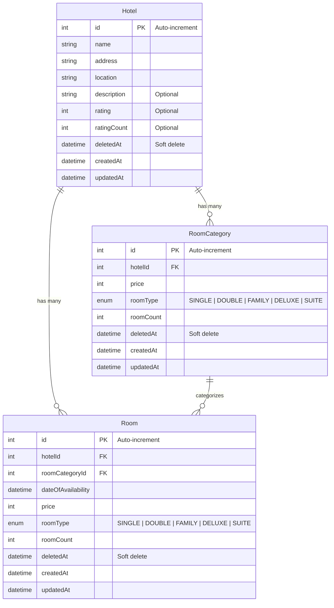

# 🏨 AirBnb Hotel Service — Project Report

> **A production-grade, microservice-ready REST API for hotel, room, and room-category management built with modern TypeScript and industry best practices.**

---

## 📋 Table of Contents

- [Project Overview](#-project-overview)
- [Tech Stack](#-tech-stack)
- [Architecture](#-architecture)
- [Project Structure](#-project-structure)
- [Database Design](#-database-design)
- [API Reference](#-api-reference)
- [Key Features & Impressive Points](#-key-features--impressive-points)
- [Middleware Pipeline](#-middleware-pipeline)
- [Error Handling System](#-error-handling-system)
- [Logging & Observability](#-logging--observability)
- [Infrastructure & DevOps](#-infrastructure--devops)
- [Getting Started](#-getting-started)

---

## 🎯 Project Overview

The **Hotel Service** is a standalone microservice designed as part of a larger AirBnb-clone platform. It owns the entire lifecycle of **Hotels**, **Rooms**, and **Room Categories** — from creation to soft deletion. The service is architected for clean separation of concerns, type safety, and production readiness from day one.

---

## 🛠 Tech Stack

| Layer              | Technology                          | Version   |
|--------------------|-------------------------------------|-----------|
| **Runtime**        | Node.js (ESM)                       | Latest    |
| **Language**       | TypeScript                          | 7.0       |
| **Framework**      | Express.js                          | 5.x       |
| **ORM**            | Prisma ORM                          | 7.10      |
| **Database**       | MySQL 8                             | 8.x       |
| **DB Adapter**     | `@prisma/adapter-mariadb`           | 7.10      |
| **Validation**     | Zod                                 | 4.x       |
| **Logging**        | Winston + Daily Rotate File         | 3.x       |
| **Containerization** | Docker Compose                    | —         |
| **Caching (Infra)**| Redis 7                             | 7.x       |
| **Dev Tooling**    | tsx (watch mode), Nodemon           | —         |
| **ID Generation**  | uuid v14                            | 14.x      |

### Why This Stack Is Impressive

- **TypeScript 7 + Strict Mode** — The most cutting-edge version of TypeScript with `strict: true`, `noUncheckedIndexedAccess`, and `isolatedModules` enabled. This catches entire categories of bugs at compile time.
- **Express 5** — Using the latest major version of Express, which includes native async error handling and improved router.
- **Prisma 7 with Driver Adapters** — Leveraging Prisma's newest ORM architecture with the MariaDB driver adapter, enabling direct database connections without the traditional Prisma query engine binary.
- **Zod 4** — The latest generation of the most popular TypeScript-first schema validation library.
- **ESM Modules** — Fully native ES modules (`"type": "module"`), no CommonJS legacy.

---

## 🏗 Architecture

The project follows a **Layered Architecture** (also known as N-Tier) with clean separation of concerns:

```
┌──────────────────────────────────────────────────────────────┐
│                        CLIENT REQUEST                        │
└──────────────────────────┬───────────────────────────────────┘
                           │
                           ▼
┌──────────────────────────────────────────────────────────────┐
│                    MIDDLEWARE PIPELINE                        │
│  ┌─────────────┐  ┌────────────┐  ┌───────────────────────┐ │
│  │ JSON Parser  │→ │ Correlation│→ │ Zod Validation        │ │
│  │              │  │ ID (UUID)  │  │ (per-route schema)    │ │
│  └─────────────┘  └────────────┘  └───────────────────────┘ │
└──────────────────────────┬───────────────────────────────────┘
                           │
                           ▼
┌──────────────────────────────────────────────────────────────┐
│                      ROUTER (v1)                             │
│   /api/v1/ping  │  /api/v1/hotel  │  /api/v1/room  │  ...   │
└──────────────────────────┬───────────────────────────────────┘
                           │
                           ▼
┌──────────────────────────────────────────────────────────────┐
│                     CONTROLLER LAYER                         │
│   Parses params  │  Delegates to service  │  Sends response  │
└──────────────────────────┬───────────────────────────────────┘
                           │
                           ▼
┌──────────────────────────────────────────────────────────────┐
│                      SERVICE LAYER                           │
│        Business logic  │  Orchestration  │  Transforms       │
└──────────────────────────┬───────────────────────────────────┘
                           │
                           ▼
┌──────────────────────────────────────────────────────────────┐
│                    REPOSITORY LAYER                          │
│     Prisma queries  │  Soft-delete logic  │  Logging         │
└──────────────────────────┬───────────────────────────────────┘
                           │
                           ▼
┌──────────────────────────────────────────────────────────────┐
│                     MySQL 8 DATABASE                         │
│   hotel  │  rooms  │  room_categories                        │
└──────────────────────────────────────────────────────────────┘
```

### Why This Architecture Is Impressive

1. **Controller → Service → Repository** — Each layer has a single responsibility, making the code testable, maintainable, and swappable.
2. **DTOs as the contract** — Zod schemas define the data contracts between the API boundary and the application layer, ensuring that invalid data never reaches the database.
3. **Versioned API** — Routes are namespaced under `/api/v1/`, enabling future non-breaking API evolution.

---

## 📂 Project Structure

```
Hotel-Service/
├── prisma/
│   ├── schema.prisma              # Database models & enums
│   └── migrations/                # 4 tracked migration history
│       ├── hotel_schema_added
│       ├── updated_hotel_model
│       ├── added_deleted_at_attr
│       └── added_rooms_and_room_category_model
├── src/
│   ├── server.ts                  # App entry point
│   ├── config/
│   │   ├── index.ts               # Server configuration
│   │   ├── prisma.ts              # Prisma client + DB connection
│   │   └── logger.config.ts       # Winston logger setup
│   ├── router/
│   │   └── v1/
│   │       ├── index.router.ts    # V1 route aggregator
│   │       ├── ping.router.ts     # Health check route
│   │       ├── hotel.router.ts    # Hotel CRUD routes
│   │       ├── room.router.ts     # Room CRUD routes
│   │       └── roomCategory.router.ts  # Room Category CRUD routes
│   ├── controller/
│   │   ├── ping.controller.ts
│   │   ├── hotel.controller.ts
│   │   ├── room.controller.ts
│   │   └── roomCategory.controller.ts
│   ├── service/
│   │   ├── hotel.service.ts
│   │   ├── room.service.ts
│   │   └── roomCategory.service.ts
│   ├── repository/
│   │   ├── hotel.repository.ts
│   │   ├── room.repository.ts
│   │   └── roomCategory.repository.ts
│   ├── dtos/
│   │   ├── ping.dto.ts
│   │   ├── hotel.dto.ts
│   │   ├── room.dto.ts
│   │   └── roomCategory.dto.ts
│   ├── middleware/
│   │   ├── correlation.middleware.ts  # Distributed tracing
│   │   ├── validate.ts               # Zod schema validation
│   │   ├── error.middleware.ts        # Global error handler
│   │   └── route-not-found.ts         # 404 catch-all
│   └── utils/
│       ├── errors/
│       │   └── app.error.ts           # Custom error classes
│       ├── responses/
│       │   └── app.response.ts        # Standardized API responses
│       └── helper/
│           └── request.helper.ts      # AsyncLocalStorage for correlation IDs
├── docker-compose.yml             # MySQL 8 + Redis 7 infra
├── prisma7.config.ts              # Prisma 7 configuration
├── tsconfig.json                  # Strict TypeScript config
├── package.json                   # Dependencies & scripts
└── .env.example                   # Environment template
```

---

## 🗃 Database Design

### Entity-Relationship Diagram



### Design Highlights

- **Soft Deletes** across all entities — Records are never physically removed; `deletedAt` timestamps enable full audit trails and data recovery.
- **Cascading Deletes** — When a Hotel is hard-deleted, all associated Rooms and Room Categories are automatically cleaned up via `onDelete: Cascade`.
- **RoomType Enum** — Strongly typed at the database level: `SINGLE`, `DOUBLE`, `FAMILY`, `DELUXE`, `SUITE`.
- **Custom Table Mapping** — Prisma model names map to clean SQL table names (`hotel`, `rooms`, `room_categories`) using `@@map()`.
- **Migration History** — 4 tracked migrations showing an iterative, professional development workflow.

---

## 🔌 API Reference

All endpoints are prefixed with **`/api/v1`**.

### Health Check

| Method | Endpoint          | Description         |
|--------|-------------------|---------------------|
| `GET`  | `/api/v1/ping`    | Health check (Pong!)|

### 🏨 Hotels

| Method   | Endpoint              | Body Validation       | Description             |
|----------|-----------------------|-----------------------|-------------------------|
| `POST`   | `/api/v1/hotel`       | `createHotelSchema`   | Create a new hotel      |
| `GET`    | `/api/v1/hotel`       | —                     | List all active hotels  |
| `GET`    | `/api/v1/hotel/:id`   | —                     | Get hotel by ID         |
| `DELETE` | `/api/v1/hotel/:id`   | —                     | Soft-delete a hotel     |

### 🛏 Rooms

| Method   | Endpoint              | Body Validation        | Description            |
|----------|-----------------------|------------------------|------------------------|
| `POST`   | `/api/v1/room`        | `createRoomSchema`     | Create a new room      |
| `GET`    | `/api/v1/room`        | —                      | List all active rooms  |
| `GET`    | `/api/v1/room/:id`    | —                      | Get room by ID         |
| `PUT`    | `/api/v1/room/:id`    | `updateRoomSchema`     | Update a room          |
| `DELETE` | `/api/v1/room/:id`    | —                      | Soft-delete a room     |

### 🏷 Room Categories

| Method   | Endpoint                    | Body Validation               | Description                 |
|----------|-----------------------------|-------------------------------|-----------------------------|
| `POST`   | `/api/v1/room-category`     | `createRoomCategorySchema`    | Create a room category      |
| `GET`    | `/api/v1/room-category`     | —                             | List all active categories  |
| `GET`    | `/api/v1/room-category/:id` | —                             | Get category by ID          |
| `PUT`    | `/api/v1/room-category/:id` | `updateRoomCategorySchema`    | Update a category           |
| `DELETE` | `/api/v1/room-category/:id` | —                             | Soft-delete a category      |

### Standardized Response Format

Every response follows a consistent JSON structure:

**Success Response:**
```json
{
  "success": true,
  "message": "Hotel Created Successfully",
  "data": { ... }
}
```

**Error Response:**
```json
{
  "success": false,
  "message": "Validation Failed",
  "details": [ ... ],
  "stack": "..." // only in development
}
```

---

## ✨ Key Features & Impressive Points

### 1. 🔗 Distributed Tracing via Correlation IDs
Every incoming request is automatically assigned a **UUID v4 correlation ID**. This ID is:
- Injected into the `x-correlation-id` request header
- Stored in **Node.js `AsyncLocalStorage`** — making it available across the entire async call chain without manual propagation
- Automatically attached to **every log entry** by the Winston logger

This is a **production-grade observability pattern** used in microservice architectures to trace a single request across multiple services and log entries.

### 2. 🛡 Zod Schema Validation Middleware
A reusable `validate()` middleware that accepts any Zod schema and:
- Rejects requests with missing bodies (`400 Bad Request`)
- Validates payloads against the schema using `safeParse()`
- Returns **structured Zod issue details** in the error response
- **Overwrites `req.body`** with the parsed output (stripping unknown fields, coercing types)
- Supports **partial schemas** for update operations (via `.partial()`)

### 3. 🗑 Soft-Delete Pattern
Entities are never physically deleted. Instead:
- A `deletedAt` timestamp is set to the current date
- All "list" queries filter by `deletedAt: null` to exclude soft-deleted records
- This enables **data recovery**, **audit trails**, and **referential integrity** preservation

### 4. 📝 Production-Grade Logging
Winston is configured with:
- **JSON-formatted structured logs** — machine-parseable for log aggregation tools (ELK, Datadog, etc.)
- **Daily rotating log files** — automatically rotated with `YYYY-MM-DD` prefixed filenames
- **Max file size of 20 MB** and **14-day retention** policy
- **Dual transports** — Console (for dev) + File (for ops)
- **Automatic correlation ID injection** — Every log line includes the request's correlation ID

### 5. 🧩 Layered Architecture with Clean Separation
```
Router → Controller → Service → Repository → Database
```
- **Routers** only wire HTTP verbs to controllers and apply middleware
- **Controllers** only parse request params and delegate to services
- **Services** contain business logic and orchestration
- **Repositories** are the only layer that touches Prisma/the database
- **DTOs** define the contract between the API boundary and the application

### 6. ⚡ Prisma 7 with Driver Adapter (MariaDB)
The project uses Prisma 7's **Driver Adapter architecture**, which:
- Eliminates the need for the traditional Prisma binary query engine
- Connects directly via the `@prisma/adapter-mariadb` package
- Supports MySQL 8 through MariaDB protocol compatibility
- Includes a robust `connectDB()` function that validates connectivity with `SELECT 1`

### 7. 🚦 Custom Error System
A unified `AppError` class with factory functions for every standard HTTP error:
- `badRequest(message, details?)` → 400
- `unauthorized(message)` → 401
- `forbidden(message)` → 403
- `notFound(message)` → 404
- `conflict(message)` → 409
- `internalServerError()` → 500

Errors include `Error.captureStackTrace()` for clean stack traces, and the global error handler conditionally exposes stack traces only in `development` mode.

### 8. 🐳 Docker-Compose Infrastructure
A single `docker-compose up` command boots the complete data layer:
- **MySQL 8** with named volumes, health checks (`mysqladmin ping`), and configurable credentials
- **Redis 7** with password authentication, named volumes, and health checks
- **Environment variable driven** — all credentials sourced from `.env`

### 9. 📐 TypeScript Strictness
The `tsconfig.json` enables the most aggressive type-checking options:
- `strict: true` (enables all strict sub-flags)
- `noUncheckedIndexedAccess` — forces `undefined` checks on array/object index access
- `noUnusedParameters` — prevents dead code
- `isolatedModules` — ensures compatibility with transpilers
- `noUncheckedSideEffectImports` — catches incorrect bare imports
- Source maps + declaration maps for debugging and library consumers

### 10. 🔄 API Versioning
Routes are namespaced under `/api/v1/`, enabling:
- Seamless introduction of `/api/v2/` without breaking existing clients
- Clear deprecation paths
- Per-version middleware stacks

---

## 🔀 Middleware Pipeline

Requests flow through the following middleware chain in order:

```
Incoming Request
      │
      ▼
┌─────────────────┐
│  express.json() │  ← Parse JSON bodies
└────────┬────────┘
         │
         ▼
┌────────────────────────┐
│  attachCorrelationId   │  ← Generate UUID, store in AsyncLocalStorage
└────────┬───────────────┘
         │
         ▼
┌────────────────────────┐
│  validate(zodSchema)   │  ← Per-route: validate req.body against Zod schema
└────────┬───────────────┘
         │
         ▼
┌────────────────────────┐
│  Route Handler         │  ← Controller logic
└────────┬───────────────┘
         │
         ▼
┌────────────────────────┐
│  routeNotFound         │  ← 404 for unmatched routes
└────────┬───────────────┘
         │
         ▼
┌────────────────────────┐
│  genericErrorHandler   │  ← Catch-all: formats AppError into JSON response
└────────────────────────┘
```

---

## ⚠ Error Handling System

The error handling is **centralized and structured**:

1. **Repository/Service** throws an `AppError` with a status code
2. **Express 5** automatically catches async errors (no `try/catch` or `next(err)` needed)
3. **`genericErrorHandler`** middleware formats the error into a consistent JSON response
4. **Stack traces** are only included in `NODE_ENV=development`
5. **Validation errors** include Zod's structured issue array in `details`

---

## 📊 Logging & Observability

```json
{
  "level": "info",
  "message": "Hotel created: 42",
  "timestamp": "01-10-2026 14:30:00",
  "correlationId": "a1b2c3d4-e5f6-7890-abcd-ef1234567890"
}
```

- Every log line is **structured JSON** — ready for ingestion by ELK Stack, Grafana Loki, or any log aggregator
- **Correlation IDs** link all log entries from a single request together
- **Daily rotation** prevents disk exhaustion with automatic cleanup after 14 days
- **20 MB max file size** prevents individual files from growing unbounded

---

## 🐳 Infrastructure & DevOps

### Docker Compose Services

| Service  | Image       | Port  | Features                                       |
|----------|-------------|-------|-------------------------------------------------|
| **mysql** | `mysql:8`  | 3306  | Named volumes, health checks, auto-restart     |
| **redis** | `redis:7`  | 6379  | Password auth, named volumes, health checks    |

### NPM Scripts

| Script                    | Command                     | Purpose                        |
|---------------------------|-----------------------------|--------------------------------|
| `npm run dev`             | `tsx watch src/server.ts`   | Hot-reload dev server          |
| `npm run build`           | `tsc`                       | Production TypeScript build    |
| `npm start`               | `node dist/server.js`       | Run production build           |
| `npm run prisma:generate` | `prisma generate`           | Generate Prisma Client         |
| `npm run prisma:migrate`  | `prisma migrate dev`        | Run development migrations     |
| `npm run prisma:studio`   | `prisma studio`             | Open Prisma visual DB explorer |
| `npm run prisma:format`   | `prisma format`             | Format Prisma schema           |

---

## 🚀 Getting Started

```bash
# 1. Clone the repository
git clone <repo-url>
cd Hotel-Service

# 2. Install dependencies
npm install

# 3. Set up environment
cp .env.example .env
# Edit .env with your credentials

# 4. Start infrastructure
docker compose up -d

# 5. Generate Prisma Client
npm run prisma:generate

# 6. Run migrations
npm run prisma:migrate

# 7. Start dev server
npm run dev

# 🎉 Server running at http://localhost:3000
# 📍 Health check: GET http://localhost:3000/api/v1/ping
```

---

## 📈 Summary

| Metric                  | Value                                  |
|--------------------------|---------------------------------------|
| **Source Files**          | 25+                                   |
| **Database Models**       | 3 (Hotel, Room, RoomCategory)        |
| **API Endpoints**         | 15                                   |
| **Middleware Layers**     | 4 (JSON, Correlation, Validation, Error) |
| **Prisma Migrations**    | 4                                     |
| **Docker Services**      | 2 (MySQL, Redis)                     |
| **TypeScript Strictness** | Maximum (`strict` + extras)          |
| **Logging Strategy**     | Structured JSON, rotated, correlated |
| **Delete Strategy**      | Soft-delete across all entities      |
| **API Versioning**       | `/api/v1/` namespace                 |

---

> **Built with ❤️ using TypeScript 7, Express 5, Prisma 7, and production-grade engineering practices.**
